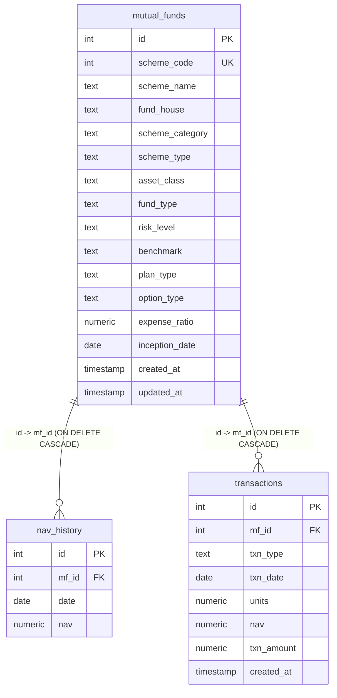

# FinDash Database Schema Diagram

## Notes

- Primary keys: `mutual_funds.id`, `nav_history.id`, `transactions.id`
- Foreign keys: `nav_history.mf_id` and `transactions.mf_id` reference `mutual_funds.id`
- `ON DELETE CASCADE` is configured for both child tables
